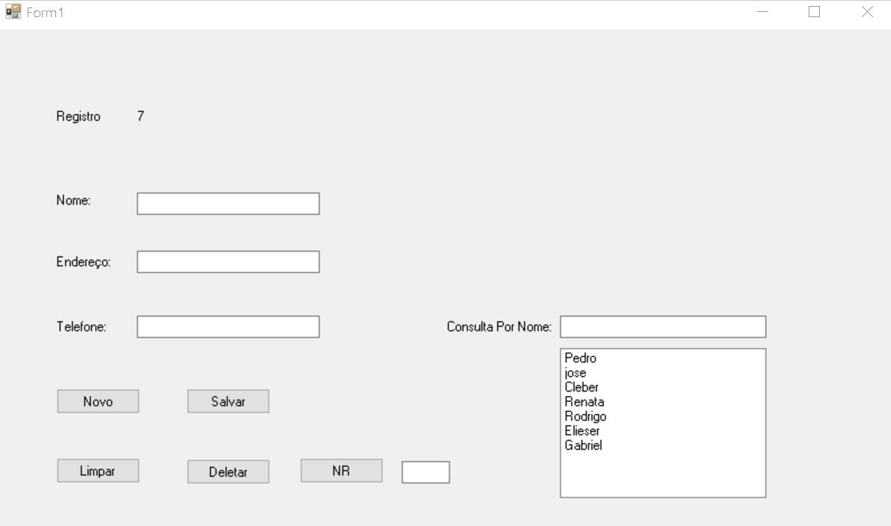

# Cadastro

 
  Este programa é um projeto que nos oferece a possibilidade de ser o cadastrar um usuário,
  os usúarios podem ser buscados pelo seu id e nome. Foi utilizado um banco txt trazendo a vantagem de ser mais rápido. 
 

 <h2>:computer: Aplicação Web</h2>
<h3> Landing Page </h3>

    

<h2> 🛠 Tecnologias</h2>
C# (Back-End);
SharpDevelop (IDE);
 
<h2> :book: Licença </h2>

Lançado em 2020 :book:
 

Feito por Gabriel Brune :rocket:. Este projeto está sobre a licença do MIT
 

Dar uma :star: se este projeto te ajudou

<h2> 🐛 Problemas</h2

Sinta-se à vontade para registrar um novo problema com o respectivo título e descrição no repositório Proffy . Se você já encontrou uma solução para seu problema, eu adoraria revisar sua solicitação de pull !

 
